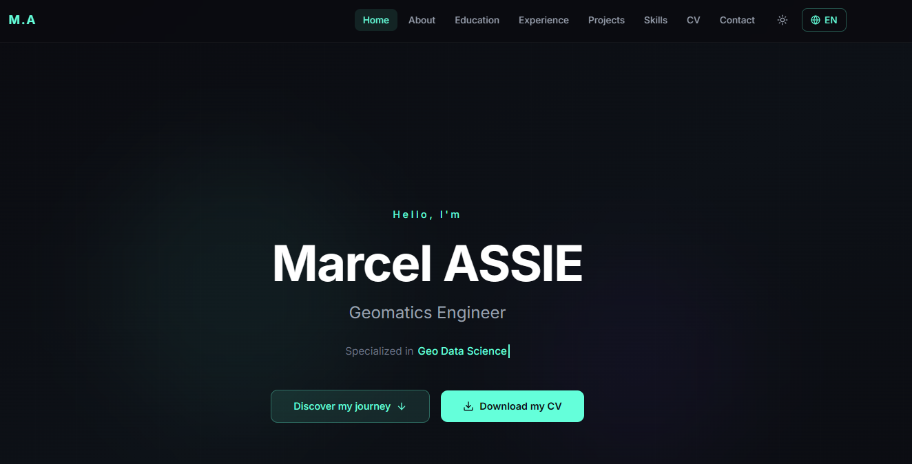

#  Portfolio Marcel Assie

Un portfolio personnel **moderne**, **interactif** et **entièrement responsive** conçu pour présenter mes projets, mes compétences et mon parcours professionnel de manière dynamique.



## À propos du projet

Ce portfolio est conçu comme une application web performante et élégante, mettant en avant :
-  **Hero Section** : Une introduction marquante avec des animations fluides.
-  **Expérience & Éducation** : Une présentation chronologique de mon parcours professionnel et académique.
- ️ **Compétences (Skills)** : Une visualisation claire de mes expertises techniques.
-  **Projets** : Une vitrine interactive de mes réalisations avec des descriptions détaillées.
-  **CV & Contact** : Une intégration fluide pour consulter mon CV et me contacter directement.
-  **Bilingue** : Support français-anglais pour une portée internationale.
-  **Mode Sombre/Clair** : Adaptation manuelle au thème préféré de l'utilisateur.

## Technologies utilisées

Le projet repose sur un stack technique moderne et performant :

- **Framework** : [React](https://reactjs.org/) (avec [Vite](https://vitejs.dev/) pour un build ultra-rapide)
- **Styling** : [Tailwind CSS](https://tailwindcss.com/) (v4) pour un design moderne et responsive
- **Animations** : [Framer Motion](https://www.framer.com/motion/) pour des transitions fluides et interactives
- **Composants UI** : [Radix UI](https://www.radix-ui.com/) & [Lucide React](https://lucide.dev/) pour l'accessibilité et l'esthétique
- **Navigation** : [React Router](https://reactrouter.com/) pour une gestion fluide des routes
- **Visualisation** : [Recharts](https://recharts.org/) pour les graphiques de compétences
- **Utilitaires** : [Sonner](https://sonner.stevenlu.com/) (notifications), [Embla Carousel](https://www.embla-carousel.com/) (sliders)

## Lancement du projet en local

Suivez ces deux étapes simples pour lancer le projet en local :

```bash
# 1. Installer les dépendances
npm install

# 2. Lancer le serveur de développement
npm run dev
```

Une fois lancé, accédez au projet via [http://localhost:5173](http://localhost:5173).

>[!Note]
> Vous pouvez consulter le portfolio en ligne sur : [Marcel Assie Portfolio](https://marcel-assie.dev)